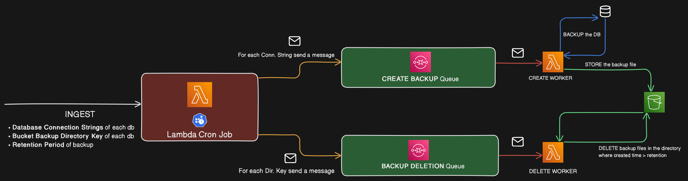

# Snapper

Snapper is an automated database backup service which can be self deployed over AWS cloud with just a few commands.

It uses [SST](https://sst.dev/) (a framework based on [Pulumi](https://www.pulumi.com/) and [Terraform](https://www.terraform.io/)) for provisioning infrastructure and deployment.

`Currently only PostgreSQL databases are supported.`

## 📦 Installation

For information regarding setting up aws cresentials for using sst refer to [sst docs](https://sst.dev/docs/aws-accounts).

Note that for easy setup, just create an IAM user with 'AdministratorAccess' policy, then configure the aws cli with the access keys of this user.

- ### Clone and install dependencies:

```bash
git clone git@github.com:anirudhaxe/snapper.git
cd snapper
pnpm i
```

- ### Set secrets:

```bash
# refer to .env.example file for more information
# this sensitive data is encryted and stored in your aws environment
# setting these secrets to stage 'prod'
pnpm sst secret set DATABASE_CONN_STRINGS "FOO-DATABASE,postgresql://..,POSTGRES|BAR-DATABASE,postgresql://..,POSTGRES|FEE-DATABASE,postgresql://..,POSTGRES" --stage prod
pnpm sst secret set BACKUP_STORAGE_DATA "FOO-DATABASE,7|BAR-DATABASE,4|FEE-DATABASE,5" --stage prod

```

- ### Deploy:

```bash
# deploying to stage 'prod'
pnpm sst deploy --stage prod
```

## 🏗️ Architecture

Snapper uses a cron job, queues, along with serverless functions and object storage for reliablility and scalability.



## 🪓 TODOs:

- Implement streaming chuks of backup file data to S3 bucket, to avoid loading whole file in function memory.
- Implement an optional encryption feature to encrypt the backup data.
- Implement some form of light UI layer to setup the backups.
- Test and handle very large data backups which may timeout the serverless function.
- Add support for other commonly used databases.
- Implement a possible saas offering.

---

### 🎉 Credits

- [pgdump-aws-lambda](https://github.com/jameshy/pgdump-aws-lambda) - for migrating pg_dump binary to lambda, other ideas and code inspirations.
